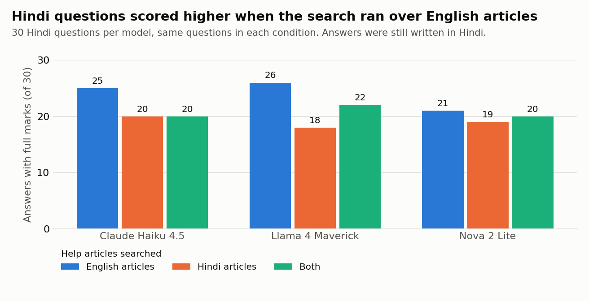
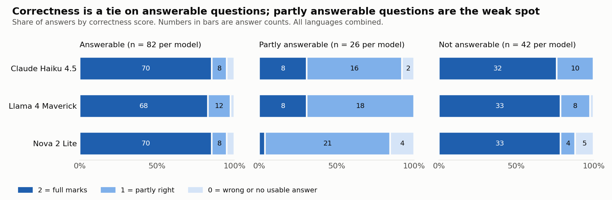
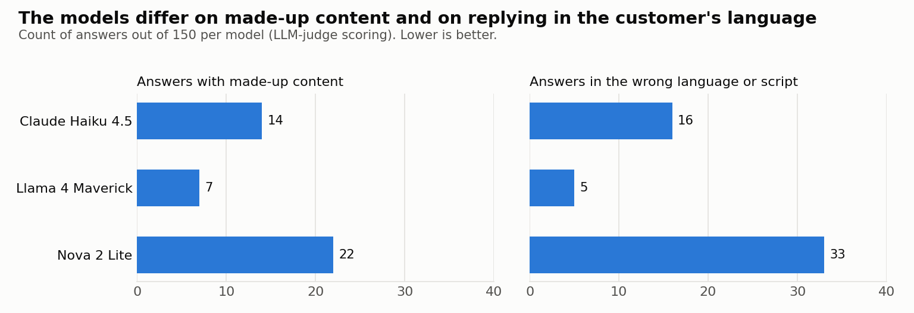
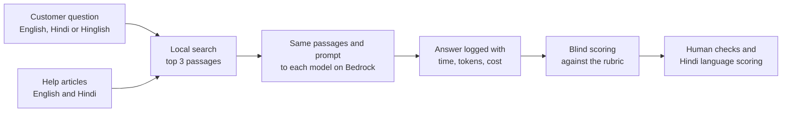

# Prime Video support assistant: a small Hindi and English evaluation

I built a customer-support assistant that answers only from Prime Video's public Help Center articles (https://www.primevideo.com/help), ran it on three models through Amazon Bedrock, and scored 450 answers in English, Hindi and Hinglish the way a Customer Experience team would.

**What I found**

- **The models tie on correctness.** Full marks on 110, 109 and 104 of 150 answers.
- **Hindi questions are answered better from English articles.** 47 of 48 answerable Hindi questions got full marks when the search ran over English articles, against 35 of 48 over Hindi articles. The weak link is search, not writing.
- **The real differences are in fidelity and language.** Made-up content ranged from 7 to 22 answers per model, and wrong-language replies from 5 to 33. The model with the fewest errors wrote the stiffest Hindi.



**Read the two-page write-up: [findings.md](findings.md).** It covers the method, seven findings, recommendations and limitations.

This is a personal project. It is not affiliated with or endorsed by Amazon.

## Results

| | Claude Haiku 4.5 | Llama 4 Maverick | Nova 2 Lite |
|---|---|---|---|
| Full marks for correctness (of 150) | 110 | 109 | 104 |
| Answers with made-up content (of 150) | 14 | 7 | 22 |
| Answers in the wrong language or script (of 150) | 16 | 5 | 33 |
| Unanswerable questions declined (of 42) | 42 | 41 | 37 |
| Hindi answers rated natural by a native speaker (of 22) | 17 | 7 | 11 |
| Median response time | 2.2 s | 0.6 s | 1.3 s |
| Estimated cost per 1,000 questions | $2.99 | $0.34 | $0.86 |

The test is small (70 questions, 35 articles), so a difference of a few answers means little. See the limitations in `findings.md` before quoting any of these numbers.




## Decisions I made, and why

- **A third of the questions can't be fully answered from the articles.** A support assistant does the most damage when it answers confidently without grounds, so the test includes questions it should decline and questions it can only half answer.
- **Hindi questions were run against English articles, Hindi articles, and both.** A team launching a new language has to decide whether to search the translated help content or the original. I wanted a number for that, not an assumption.
- **The judge never saw model names.** One of the three models comes from the same family as the judge, so the names were hidden until scoring was finished.
- **I scored Hindi quality myself and reported the judge's failure.** When the LLM judge agreed with me only 56% of the time, I dropped it for that measure and kept the failed test in the write-up, because the next team will be tempted to do the same thing.
- **No winner is named.** The models tie on correctness at this sample size. Picking one would have made a tidier story than the data supports.
- **Amazon's content is not republished.** The repository links to the help articles and leaves out both the article text and the model answers that paraphrase it.

## Where this applies

The numbers describe 70 questions on one help center. The method is what carries over:

- **Choosing a model for multilingual support.** Same passages, same prompt and a four-measure rubric separate models that look identical on accuracy alone.
- **Launching support in a new language.** Whether to search translated articles or the originals can be tested cheaply, before any translation budget is spent.
- **Cheap guardrails.** A script check on reply language, and declining when search confidence is low, would each have prevented a visible share of the bad answers here.
- **Trusting an LLM judge.** Check it against native speakers in each new language first. Here it held up on the English answers I checked and did not hold up for Hindi fluency.

## What I would do next

1. **Use real customer questions, and more of them.** These 70 are mine. With access and privacy review, I would sample several hundred real contacts per language, since real customers ask messier questions than I wrote.
2. **Measure whether the customer's problem was solved.** Rubric scores are a stand-in. The measures that matter are resolution, repeat contacts and satisfaction, tested with a small live pilot and a clear path to a human agent.
3. **Fix Hindi search before anything else.** It was the main difference between the Hindi conditions. I would compare multilingual embedding models, add reranking, and score search at the passage level instead of the article level.
4. **Give "partly answerable" its own fix and metric.** Every model failed here, and overall accuracy hides it.
5. **Add raters.** One native speaker scored Hindi. Three raters per language, with their agreement reported, would make the language findings firm, and would show what register customers want: some answers I marked down were correct but too formal for everyday Hindi.
6. **Extend to more languages and models.** Tamil, Telugu, Bengali and Marathi next, each with native raters, plus the larger models this run could not include.

## How it works



1. `src/extract_articles.py` turns help pages you have saved by hand into plain text.
2. `src/build_index.py` splits the articles into passages and embeds them with Titan Text Embeddings V2. The vectors are stored in a local file; there is no vector database.
3. `src/run_eval.py` finds the 3 closest passages for each question and sends the same passages and system prompt to each model through the Bedrock Converse API. It logs the model, question, passages used, answer, response time, tokens and estimated cost.
4. Answers are scored against `scoring/RUBRIC.md`.
5. `src/analyze.py` and `src/make_charts.py` produce the summary tables and charts.

Hindi and Hinglish questions are run three times: searching English articles, Hindi articles, and both. The system prompt is in `src/config.py`.

## How the scoring was done

- **Rubric.** Four measures per answer: correctness (0–2), made-up content, declining when the articles don't cover the question, and replying in the customer's language and script. The rules are in `scoring/RUBRIC.md`.
- **LLM judge, blind to the model.** An LLM judge (Claude) applied the rubric to all 450 answers and recorded a one-line reason per score. Each answer was given a random ID with the model name removed, and the names were matched back only after all scoring was finished.
- **Checks on the judge.** A second blind pass on 42 answers gave the same correctness score on 37. I read through a sample of 30 English answers against the judge's scores and found none I would change.
- **Hindi and Hinglish language quality.** I scored 89 answers myself as a native speaker (about 30 per model), using `scoring/RUBRIC_LQ.md`. I also tested the LLM judge on this measure and dropped it: it agreed with me only 56% of the time and favoured the model from its own family.

## Data source and how the help content was used

The only source is the public Prime Video Help Center: <https://www.primevideo.com/help>. `data/sources.csv` lists the 35 articles used, with a link to the English and Hindi version of each and the date it was saved (October 01, 2026).

- **Collected by hand.** I opened each page in a browser and saved it myself, 70 pages in all. No crawler, script or other automated tool was used to fetch pages, and the site's `robots.txt` was respected.
- **Not redistributed.** The article text belongs to Amazon and is not in this repository. The `.gitignore` keeps the saved pages, the extracted text, the search index and the model answers out of version control. The repository links to the articles instead.
- **Used for evaluation only.** The saved text was used locally to test the assistant.
- **No private data.** No customer data, account data or non-public material was used. The test questions are my own.

This is a non-commercial personal project, not affiliated with or endorsed by Amazon. If you reproduce it, read Prime Video's current terms of use first and save the pages yourself. If anyone at Amazon would like something here changed or removed, please open an issue.

## What is in the repository

| Path | Contents |
|---|---|
| `findings.md` | The write-up |
| `data/sources.csv` | The 35 help articles used, with links to the English and Hindi pages |
| `data/questions.csv` | The 70 test questions, with labels and notes |
| `src/` | Scripts and `config.py` (models, prompt, prices) |
| `results/scores.csv` | Scores for all 450 answers, with a one-line reason for each |
| `results/run_log.csv` | Per-answer log: passages retrieved, response time, tokens, estimated cost |
| `results/language_quality.csv` | Native-speaker language scores for 89 Hindi and Hinglish answers, and the LLM-judge scores they were compared with |
| `results/retrieval_report.csv` | Which articles the search returned for each question |
| `results/summary_by_model.csv`, `results/summary_by_model_language.csv` | Summary tables |
| `results/charts/` | Three charts |
| `scoring/` | The two rubrics |
| `SETUP_AWS.md` | AWS account steps and a least-privilege IAM policy |

The model answers themselves are not published, because they paraphrase the help articles closely. `run_eval.py` writes them to `results/raw_answers.jsonl` on your own machine.

## Running it yourself

You need Python 3.9+, an AWS account with Bedrock model access in `us-east-1`, and an AWS CLI profile named `pv-eval` (or change `AWS_PROFILE` in `src/config.py`). `SETUP_AWS.md` has the account steps and a least-privilege IAM policy.

```
pip install -r requirements.txt
# save the pages in data/sources.csv as HTML under <folder>/<Category>/<Article>/, then:
python src/extract_articles.py <folder-with-saved-pages> data
python src/build_index.py            # prints a cost estimate; add --yes to run
python src/retrieve.py               # search report, no model calls
python src/run_eval.py --limit 5     # small test; prints a cost estimate first
python src/run_eval.py --yes         # full run
python src/analyze.py
python src/make_charts.py
```

The full run cost about $0.58, and the whole project about $0.64. Every paid step prints an estimate and waits for `--yes`. Nothing in the setup has an hourly charge.

## Notes

- Claude Sonnet 5.5 was the planned Claude model but was not available on my AWS account, so Claude Haiku 4.5 was run in its place. Sonnet 5.5 is still in `src/config.py` and can be added with `python src/run_eval.py --models sonnet-5.5 --yes`.
- The system prompt was revised once after a 5-question test (version 2: reply in the question's language, and don't mention "excerpts").
- Costs use list prices on October 01, 2026 and are estimates.
